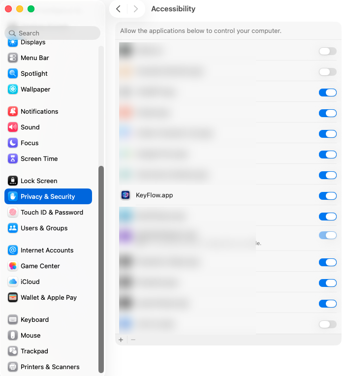

# KeyFlow

**Website:** [weird-mirror.github.io/keyflow](https://weird-mirror.github.io/keyflow/) ·
**Download:** [latest release](https://github.com/weird-mirror/keyflow/releases/latest)

Automatic keyboard layout switcher for macOS.
Type without thinking about whether the Cyrillic or Latin layout is active —
KeyFlow fixes the word as you type, mid-word, before you even reach space.

Supports **English**, **Ukrainian** and **Russian**.

> Local-first. Open-source. No cloud, no telemetry, no analytics.
> Your keystrokes never leave your Mac.

---

## Why

You start typing a message in Russian, half a word in you realize the keyboard
is still in English and you're staring at `ghbdtn` instead of `привет`.
Backspace, switch layout, retype. Many times a day.

KeyFlow detects the wrong-layout situation by looking up the typed sequence in
three dictionaries (en / ru / ua). It works two ways: **live**, mid-word — as
soon as the first few characters can only be a real word in another layout, it
switches immediately; and at the **word boundary** (space, punctuation, Enter)
as a fallback. If the word doesn't exist in the active layout's language but its
key-position translation does in another, KeyFlow rewrites the word and flips
the keyboard layout for you.

It also gives you a single-key manual override (tap `⌘ Cmd` alone) to cycle the
last word through the three layouts when the detector is unsure.

## Features

- **Live correction** — switches mid-word (after a few characters) once the
  layout is unambiguous, no need to wait for space
- Auto-correction on space, punctuation or Enter as a fallback — no UI prompt,
  just the right word in the right layout
- Three layouts in one cycle: en → ru → ua
- Single-tap manual conversion (default: ⌘ Cmd alone, configurable)
- Per-app **blacklist** — autocorrect everywhere except where you don't want it
- Word **exceptions** — list of words to leave alone
- **Password field detection** — never touches input in `AXSecureTextField`
- **Secure Keyboard Entry warning** — menu-bar icon turns orange when another
  app is hiding your typing, instead of failing silently
- **Launch at login** toggle
- **Show in Dock** toggle (menu bar only or full Dock presence)
- Self-contained `.app` bundle with built-in dictionaries
- Drag-to-install DMG

## Installation

1. Download `KeyFlow.dmg` from the
   [latest release](https://github.com/weird-mirror/keyflow/releases/latest)
   or build it yourself (see below).
2. Open the DMG and drag `KeyFlow.app` into `Applications`.
3. Launch from Spotlight (`⌘ Space → "KeyFlow"`).
4. On first launch macOS will prompt for **Accessibility** permission —
   KeyFlow needs this to read and rewrite keystrokes. Grant it in
   *System Settings → Privacy & Security → Accessibility* by enabling the
   toggle next to **KeyFlow.app**:

   

5. The app keeps a `⌥` icon in the menu bar. Click it → *Settings…* to
   configure.

## How it works

```
EventTap ──► Coordinator ──► WordBuffer
                │
                ├──► LayoutDetector ─► en/ru/ua dictionary + exceptions
                │
                └──► Replayer ──► LayoutSwitcher (TIS) + CGEvent
```

- **EventTap** (`CGEventTap`) reads every keystroke at the session level.
- **WordBuffer** accumulates characters until a word boundary (space,
  punctuation, Enter).
- **LayoutDetector** checks the buffered word against three dictionaries.
  If it's gibberish in the current layout but a real word in another layout
  (after physical-key-position translation), it returns the correction.
- **Replayer** issues backspaces for the original word, calls `TISSelectInputSource`
  to switch the system layout, then types the corrected word — all via
  synthesized `CGEvent`s marked with a sentinel so they don't loop back into
  our own tap.

The translator works by **physical key position**, not by character.
Typing `привіт` on a Ukrainian keyboard and `ghbdsn` on an English keyboard
both produce the same six key presses; KeyFlow knows how to round-trip those.

## Settings overview

- **Autocorrect on space / punctuation** — master switch.
- **Live correction** — switch mid-word after N characters (default 3); turn off
  to only correct at word boundaries.
- **Active layouts** — per-layout checkboxes; the cycle and detector ignore
  disabled ones.
- **Manual hotkey** — tap-modifier picker (Cmd / Opt / Ctrl / Shift).
  Tap the chosen modifier once with no other key held to cycle the last
  word's layout.
- **Blacklist** — bundle IDs to ignore. Default is empty (works everywhere).
- **Launch at login** — uses `SMAppService`.
- **Show in Dock** — toggle full Dock presence on/off; menu bar icon remains
  either way.
- **Exceptions** — words the detector never touches.

All settings are stored in
`~/Library/Application Support/KeyFlow/settings.json`.

## Troubleshooting

**KeyFlow isn't correcting anything / the menu-bar icon shows an orange (!)**

Some app has turned on macOS **Secure Keyboard Entry**. While it's active, the
system hides every keystroke from all event taps — KeyFlow (and any other
layout switcher) goes blind, even though tapping the modifier still switches the
layout. The icon turns into an orange exclamation mark when this happens.

The usual culprit is **Terminal** or **iTerm** with *Secure Keyboard Entry*
enabled in their menu — turn it off there (Terminal → uncheck *Secure Keyboard
Entry*). A focused password field in a browser can also enable it temporarily.

**KeyFlow stopped working after I rebuilt / updated it**

KeyFlow signs its builds with a stable self-signed certificate so the macOS
Accessibility grant survives updates. If you build from source on a machine
without that certificate, the build falls back to ad-hoc signing, whose
signature changes every build and silently revokes the Accessibility grant —
re-grant it in *System Settings → Privacy & Security → Accessibility*, or create
a stable signing identity (see `build_app.sh`).

## Privacy

KeyFlow needs **Accessibility** permission, which lets it read every
keystroke on the system. That's a serious capability and you should only
grant it to software you trust.

What KeyFlow does with that access:

- Keeps a buffer of the **current word** in memory (cleared on mouse click,
  app switch, modifier press, and after every word boundary).
- Looks the word up in three local dictionaries.
- If a correction is needed: synthesizes backspaces + a layout switch +
  retypes the corrected word.

What it does **not** do:

- No network connections — anywhere, ever.
- No telemetry, no analytics, no error reporting.
- No persistent log of typed text.
- No keystroke goes anywhere beyond the in-memory word buffer.

For password fields, the focused element's `kAXRoleAttribute` is checked
against `AXSecureTextField` and the buffer is reset without processing.

## Building from source

Requirements: macOS 13+, Xcode Command Line Tools (`xcode-select --install`).
Apple Silicon recommended.

```sh
git clone https://github.com/weird-mirror/keyflow.git
cd keyflow

# 1. Download dictionaries (LibreOffice hunspell wordlists).
mkdir -p dicts
curl -L -o dicts/en_US.dic https://raw.githubusercontent.com/LibreOffice/dictionaries/master/en/en_US.dic
curl -L -o dicts/ru_RU.dic https://raw.githubusercontent.com/LibreOffice/dictionaries/master/ru_RU/ru_RU.dic
curl -L -o dicts/uk_UA.dic https://raw.githubusercontent.com/LibreOffice/dictionaries/master/uk_UA/uk_UA.dic
python3 scripts/build_dictionaries.py --en dicts/en_US.dic --ru dicts/ru_RU.dic --ua dicts/uk_UA.dic

# 2. (Optional) drop a 1024×1024 icon.png at repo root to bundle a custom icon.

# 3. Build the app bundle + DMG.
./build_app.sh release
```

Output: `.build/app/KeyFlow.app` and `.build/dmg/KeyFlow-<version>.dmg`.

### Why not just `swift build`?

The project does include a `Package.swift`, but Swift Package Manager has
known issues with menu-bar / SwiftUI macOS executables and certain
Command Line Tools versions ship a broken `PackageDescription`. The
`build_app.sh` script bypasses SPM by calling `swiftc` directly and
assembles the `.app` bundle by hand.

If you have full Xcode installed, `swift test` should work for running
the unit tests; otherwise use:

```sh
./test.sh
```

## Project layout

```
Sources/KeyboardSwitcher/  Swift source for the app
Tests/                     Unit tests (standalone runner)
scripts/
  build_dictionaries.py    hunspell → plain wordlist
  make_icns.sh             icon.png → AppIcon.icns
build_app.sh               build .app + DMG
test.sh                    run the standalone test suite
build.sh                   legacy: build a CLI-only binary
```

## Dictionaries

The bundled wordlists are derived from [LibreOffice
dictionaries](https://github.com/LibreOffice/dictionaries) (hunspell), which
are themselves open-source. See their repository for licensing of the source
data.

## Roadmap

- [ ] Apple Developer code signing + notarization (so the DMG works without
      right-click → Open on a fresh machine)
- [ ] Homebrew cask
- [ ] Optional context-aware language detection via Apple's
      `NLLanguageRecognizer`
- [ ] Self-growing personal vocabulary (auto-add proper names to exceptions
      after N unrolled uses)
- [ ] Per-app preferred-layout learning
- [ ] Custom hotkey combos in the UI (not just modifier taps)
- [ ] Localized UI (Russian, Ukrainian)

## Contributing

Bug reports and PRs welcome. A few ground rules:

- Run `./test.sh` before opening a PR.
- The `Coordinator` is the only place where event flow logic should live;
  everything else stays single-responsibility.
- No telemetry, no network calls — these are non-negotiable.

## Support

KeyFlow is free and open-source, and will stay that way. If it saves you time
every day, you can [buy the developer a coffee](https://buymeacoffee.com/weird_mirror).

## License

MIT — see [LICENSE](LICENSE). Use it, fork it, ship it.
